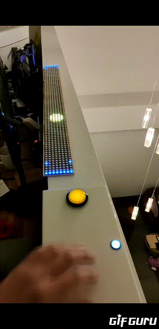
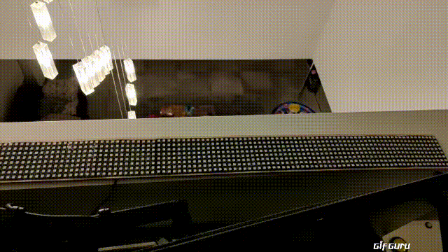
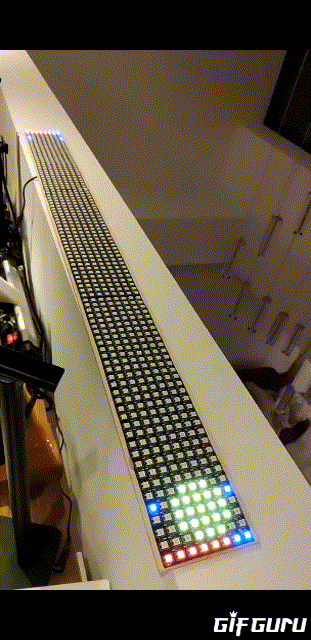
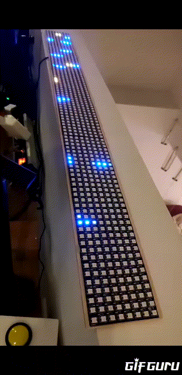
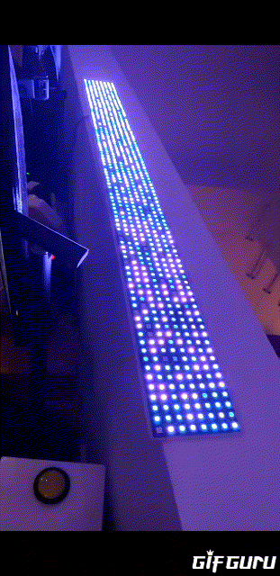

# led-matrix-pong-mqtt

A fork from c-base/1d-led-stripe

A simple pong game for a matrix led, combined with a text display, disco effects and an image display on boot. 
Broadcasts and listens on MQTT.

This project contains just some code for playing around, cleanup, refactorings etc can easily be applied. 

Requirements:

  * ESP8266
  * 3 x 32*8 Neopixel matrix display
  * Platformio

--------------
Starts with a splash image:

Display texts:

54 Disco effects:

